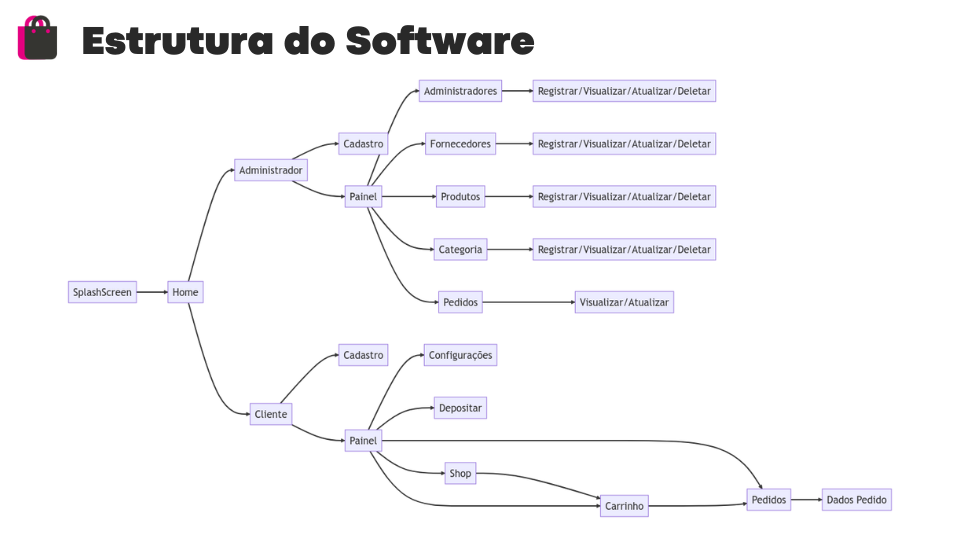
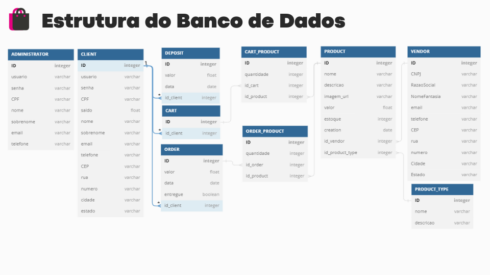
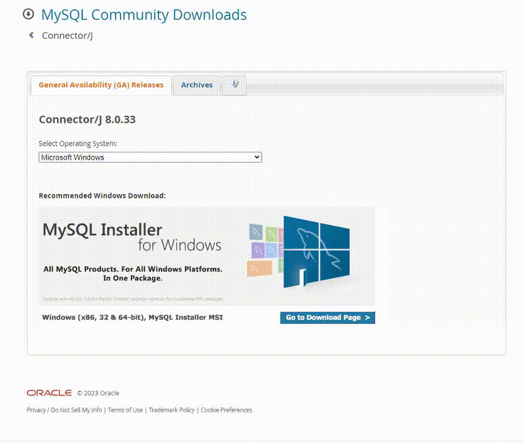
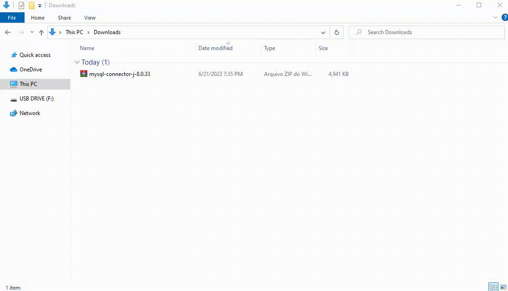
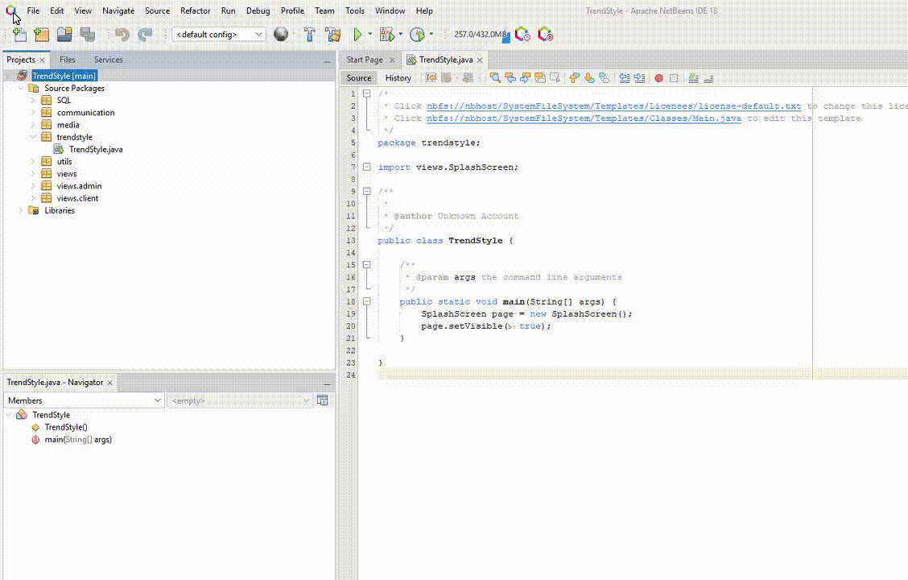
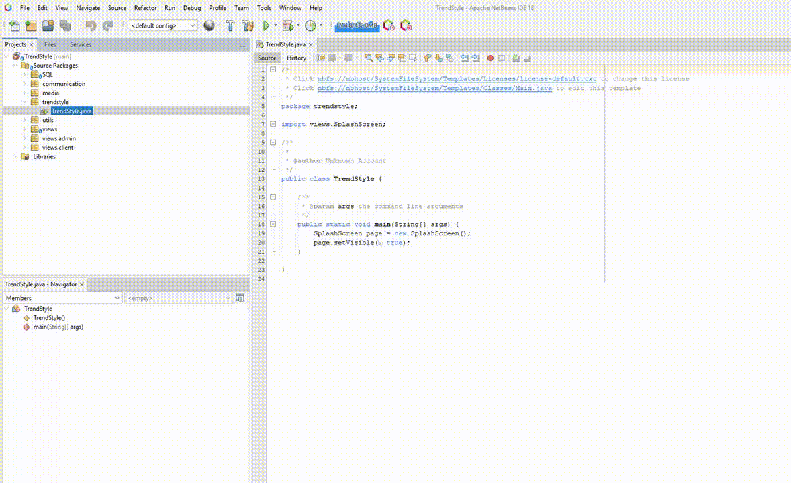

# 🎓 TrendStyle Shop

## 📘 About the Project

TrendStyle is a project developed in Java using a MySQL database, simulating an online store in the e-commerce realm. It aims to provide an optimized management and purchasing experience with real-time updates.

The administrative interface of the prototype allows management of various operational aspects, including suppliers, product categories, and items for sale. Administrators can also manage other users with management privileges. Additionally, the order processing system enables updating order statuses and providing simulated delivery information.

The customer interface is designed to offer an intuitive and easy shopping experience. Users can view all products, add them to the cart, and make fictional payments through deposits recorded in the system. They can also track the status of simulated orders and update their personal information.


## 🔧 System Construction

The TrendStyle system was built using Java and the NetBeans IDE. We chose these technologies for their ability to handle large-scale projects and enable efficient development. We used Canva for user interface design, providing an intuitive and pleasant experience.

The project is divided into several screens, creating dedicated panels for administrators and customers. These elements are directly integrated with a database optimized to maximize performance and facilitate implementation in the Java project.

We developed several Procedures and Views in the database to enhance data handling and overall system efficiency. These tools have custom restrictions and adjustments for each action, ensuring the system operates with the highest efficiency possible.




## 💻 Technologies Used

- ☕️ Java & NetBeans
- 📊 Mermaid.js & dbdiagram.io
- 🐬 MySQL & MySQL Workbench
- 🎨 Canva

## 📋 Requirements to Use the System

To run the NotFound Server locally, you need to have the following software installed:

- ☕️ Java (JDK 17)
- 🔶 NetBeans
- 🐬 MySQL Server (8.0.33)

You should also be familiar with the NetBeans IDE, have a basic understanding of Java, and know how to use and configure a MySQL database.

## 🚀 How to Use

1. Clone the repository with the following command:

    ```sh
    git clone https://github.com/WhitePoodleMoth/TrendStyle.git
    ```

2. Install and configure your [MySQL Community Server 8.0.33](https://dev.mysql.com/downloads/mysql).

3. Next, install [Connector/J 8.0.33](https://dev.mysql.com/downloads/connector/j/):

    

4. Unpack the Connector and remove the compressed file:

    

5. In NetBeans, open the project, right-click, select properties -> libraries -> add classpath -> (select the connector jar file) and confirm:

    

6. To create the database structure, execute the SQL files located in the [TrendStyle/src/SQL](TrendStyle/src/SQL) folder in the following order:

    ```sh
    DATABASE.sql (Required)
    SCHEMA.sql   (Required)
    POPULATE.sql (Optional)
    ```
    * Use [MySQL Workbench](https://dev.mysql.com/downloads/workbench/) to facilitate executing the SQL files.

7. Modify the [TrendStyle\src\communication\MySQL.java](TrendStyle/src/communication/MySQL.java) file with your server information:

    ```java
    private String server = "localhost:3306";
    private String databaseName = "TrendStyle";
    private String user = "root"; // Enter your user here
    private String password = "root";   // Enter your password here
    ```
8. Right-click on the project and select "Clean and Build" to prepare it for execution.

9. Now that everything is set up, just run the software and explore its features!

    

## 👥 Developers

- [WhitePoodleMoth](https://github.com/WhitePoodleMoth)
- [RosyMaple](https://github.com/RosyMaple)

## 📄 License

TrendStyle Shop is licensed under the MIT License. See the [LICENSE](LICENSE) file for more details.
